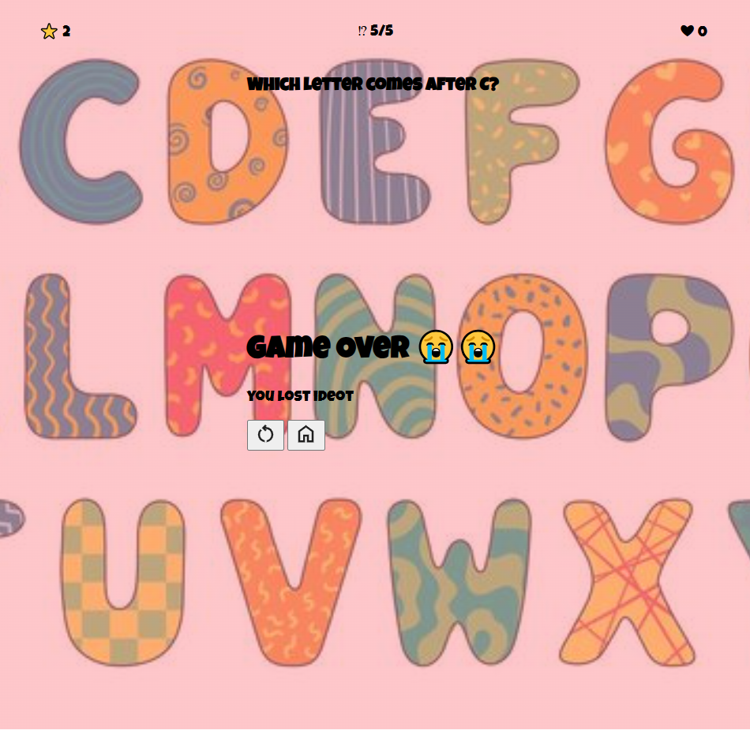

# Project-1-Kids-Game
this game is aimed for kids to teach them about alphabets, animals, numbers and simple math, and colors



## Getting Started

### play The Game

### How To Play

### Installation 

### Technologies Used
```bash
git clone
cd memory
open index.html
```
### Future Enhancments

### Credits